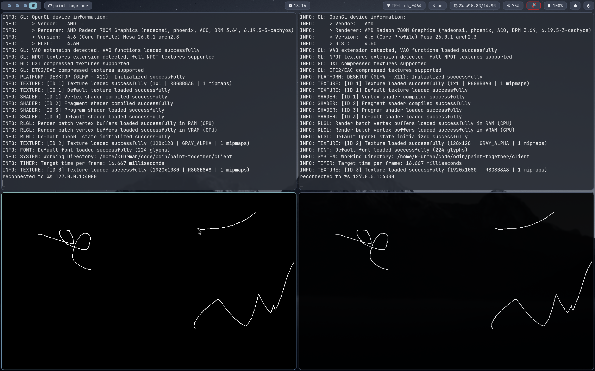

# Paint Together

Super simple real-time multi-user paint app:

- Client: Odin + raylib (`1920x1080` black canvas)
- Server: Elixir `mix` app on OTP TCP/ETS primitives
- Draw with left click (white), erase with right click (black)
- Network sends only changed pixels in batches



See `PROTOCOL.md` for message format.

## Layout

- `client/main.odin` - raylib painter + TCP client
- `server/mix.exs` - Elixir server project
- `server/lib/paint_together/server.ex` - listener, accept loop, snapshot + broadcast flow
- `server/lib/paint_together/client.ex` - per-client TCP process and frame parsing
- `server/lib/paint_together/canvas.ex` - ETS-backed authoritative canvas state

## Run

Start server:

```bash
cd server
mix run --no-halt
```

Start client (default server `127.0.0.1:4000`):

```bash
cd client
odin run .
```

Or specify host:port:

```bash
cd client
odin run . -- 192.168.1.50:4000
```

Open multiple clients and draw to verify real-time sync.

## Behavior

- Single shared room
- Server stores authoritative canvas in memory
- New clients receive snapshot chunks with only non-black pixels
- Deltas are broadcast to every client except the sender
